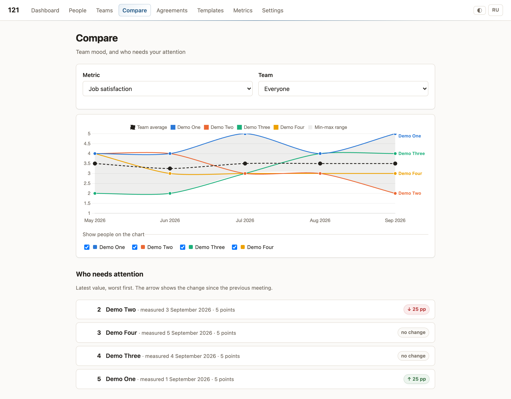

# 121

*Read in English: [README.md](README.md)*

Self-hosted инструмент для регулярных 1:1 встреч: люди и команды, встречи по кастомному
плану, динамика метрик во времени, сравнение людей между собой и саммари для подопечного
без приватной части.

Работает локально: Bun + SQLite, без шага сборки, без внешних сервисов, без CDN.
Данные о людях чувствительные — они не должны уезжать в чужой SaaS.

<picture>
  <source media="(prefers-color-scheme: dark)" srcset="docs/compare-dark.png">
  
</picture>

*Страница «Сравнение» на данных `bun run demo`. Скриншот следует вашей цветовой схеме: светлая и тёмная — две отдельно провалидированные палитры.*

## Запуск

```sh
bun install
cp .env.example .env      # необязательно: значения по умолчанию рабочие
bun run start             # http://127.0.0.1:3121 — ваши настоящие 1:1
```

Миграции применяются сами при старте. Боевая база — `data/121.sqlite`; каталог `data/`
целиком в `.gitignore`.

Две базы, а не одна: демо-данные и настоящие записи о людях не должны перемешиваться
даже по случайности, поэтому у режима разработки своя.

| Команда | База | Для чего |
| --- | --- | --- |
| `bun run start` | `data/121.sqlite` | Настоящая работа. Без watch. |
| `bun run dev` | `data/dev.sqlite` | Разработка: watch-перезапуск. |
| `bun run demo` | `data/dev.sqlite` | 4 выдуманных человека, 20 завершённых встреч — посмотреть графики и сравнение на заполненных данных. |

`start` не задаёт `DB_PATH` сам, поэтому базу можно перенести куда угодно через `.env`.
`dev` и `demo`, наоборот, прибиты к `data/dev.sqlite` жёстко: присвоение в командной
строке сильнее `.env`, и это то, что не даёт `bun run demo` однажды дописать выдуманных
людей к настоящим. Проверяется тестом `tests/run-targets.test.ts`, а не договорённостью.

Если нужен watch по боевой базе — это `bun --watch src/server.ts` напрямую, осознанно.

## Что уже работает

- **Люди** — CRUD, роль, каденс встреч, приватные заметки руководителя, ссылка на
  постоянную комнату созвона: кнопка «Открыть встречу» на дашборде, в списке, в карточке
  и в шапке встречи.
- **Встречи по шаблону** — секции и типизированные поля (шкала, текст, строка, чекбокс,
  дата, выбор одного/нескольких), автосохранение по полю.
- **Конструктор шаблонов** — секции и вопросы, порядок перетаскиванием или стрелками,
  привязка к метрике, флаг видимости, проверка шаблона, версии с диффом. Правка шаблона,
  по которому уже прошли встречи, создаёт новую версию: прошлые встречи не меняются.
- **Метрики** — создание и правка, счётчик использования. Ключ метрики фиксируется, как
  только на неё начали ссылаться: от него зависит непрерывность истории.
- **Договорённости** — с ответственным, сроком и видимостью; незакрытые сами всплывают
  в повестке следующей встречи.
- **Каденс** — дашборд «просрочено / скоро / в порядке», без крона и уведомлений.
- **Графики** — динамика метрики по человеку; сравнение людей на одном полотне
  (среднее по команде, полоса разброса, индивидуальные линии) и список
  «кому уделить внимание».
- **Саммари для подопечного** — неизменяемый снапшот из полей, помеченных `shared`,
  ссылка с токеном и выгрузка в Markdown.
- **Экспорт и бэкап** — полная выгрузка в JSON и Markdown, копия базы через `VACUUM INTO`.
- **Языки** — русский и английский с переключателем.

Полный план, обоснования решений и планы на v2 — в [PLAN.md](PLAN.md).
Правила, которые нельзя нарушать при доработке — в [CLAUDE.md](CLAUDE.md).
Визуальная спецификация и канвас редизайна — в [design/](design/README.md).

## Приватность

У каждого поля шаблона есть флаг `shared` / `private`. Приватное не покидает инстанс:
ни в саммари, ни в Markdown, ни в данных графиков. Это проверяется тестом
`tests/snapshot-privacy.test.ts`, который заполняет приватным сентинелом каждый тип поля
и ищет его во всех поверхностях шаринга.

Экспорт — наоборот, включает приватное: это бэкап, а не саммари. Поэтому это отдельные
функции с отдельными роутами.

## Ограничения v1

Авторизации нет: приложение слушает `127.0.0.1`, любой пришедший считается хозяином.
Поэтому share-ссылку подопечный не откроет — саммари отправляется файлом. Авторизация,
облачная установка и доступ с разных устройств — v2; модель данных к этому готова
(см. раздел «v2» в PLAN.md).

## Разработка

```sh
bun test          # 163 тестов
bunx tsc --noEmit # типы
bun run backup    # копия базы в data/backups/
```

Миграции — нумерованные `.sql` в `src/db/migrations/`, применяются вперёд по
`PRAGMA user_version`. Контрольные суммы применённых миграций сверяются при старте:
править уже применённый файл нельзя, нужна новая миграция.

Код, идентификаторы и комментарии — английские; кириллица допускается только в слое
локализации (`src/i18n/`). Стартовый шаблон в сиде тоже английский: это пользовательский
контент, но его видит каждый, кто поставил инструмент, и он переименовывается в
конструкторе. Это проверяется тестом, а не договорённостью:
`bun test tests/language.test.ts`. Пользовательский текст не пишется в коде — он живёт в
словарях `src/i18n/ru.ts` и `src/i18n/en.ts` и достаётся по ключу, а доменные ошибки несут
код, который переводит слой отображения.
